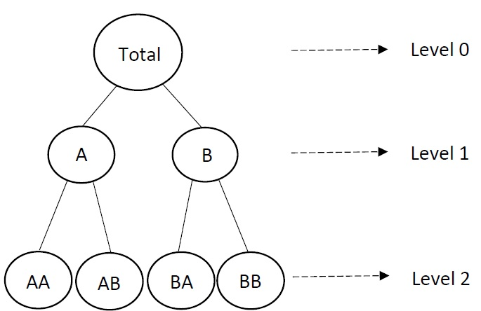
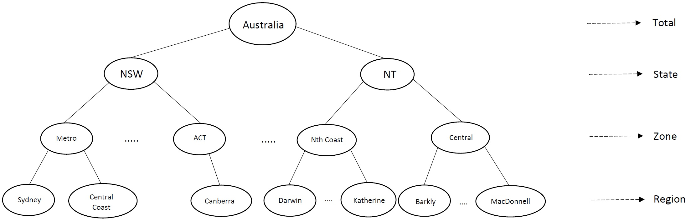
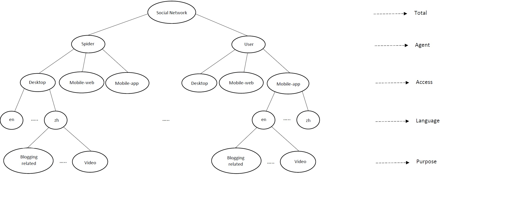

```{r setup, include=FALSE, message=FALSE}
knitr::opts_chunk$set(echo = FALSE, cache = FALSE, message = FALSE, warning = FALSE)
library(tidyverse)
library(knitr)
library(kableExtra)
library(patchwork)
```

# Introduction

Modern data collection tools have dramatically increased the amount of available time series data [@januschowski2013forecasting]. For example, the internet of things and point-of-sale scanning produce huge volumes of time series in a short period of time. Naturally, there is an interest in forecasting these time series, yet forecasting large collections of time series is computationally challenging.

## Hierarchical and grouped time series

In many cases, these time series can be structured and disaggregated based on hierarchies or groups such as geographic location, product type, gender, etc. An example of hierarchical time series is sales in restaurant chains, which can be disaggregated into different states and then into different stores. Figure \@ref(fig:hierarchicalexample) shows a schematic of such a hierarchical time series structure with three levels. The top level is the total series, formed by aggregating all the bottom level series. In the middle level, series are aggregations of their own child series; for instance, series A is the aggregation of AW and AX. Finally, the bottom level series, includes the most disaggregated series.

```{r hierarchicalexample, out.width = "200px", out.height= "170px,trim=0 0 190 0,clip=true", fig.align="center", fig.cap="An example of a two level hierarchical structure."}

```

Grouped time series involve more complicated aggregation structures compared to strictly hierarchical time series. To take the simplest example, suppose we have two grouping factors which are not nested: sex (Male/Female) and city (New York/San Francisco). The disaggregated series for each combination of sex and city can be combined to form city sub-totals, or sex sub-totals. These sub-totals can be combined to give the overall total. Both sub-totals are of interest.

We can think of such structures as hierarchical time series without a unique hierarchy. A schematic of this grouped time series structure is shown in Figure \@ref(fig:groupexample) with two grouping factors, each of two levels (A/B and C/D). The series in this structure can be split first into groups A and B and then subdivided further into C and D (left side), or split first into C and D and then subdivided into A and B (right side). The final disaggregation is identical in both cases, but the middle level aggregates are different.

```{r groupexample, out.width = "330px", out.height= "180px", fig.align="center", fig.cap="An example of a two level grouped structure."}
G1 <- grid::rasterGrob(as.raster(png::readPNG("Paper-Figures/Group_1.png")), interpolate = FALSE)
G2 <- grid::rasterGrob(as.raster(png::readPNG("Paper-Figures/Group_2.png")), interpolate = FALSE)
gridExtra::grid.arrange(G1, G2, ncol = 2)
```

We use the same notation [following @fpp2] for both hierarchical and grouped time series. We denote the total series at time $t$ by $y_t$, and the series at node $Z$ (subaggregation level $Z$) and time $t$ by $y_{Z,t}$. For describing the relationships between series, we use an $N\times M$ matrix, called the "summing matrix", denoted by $\bm{S}$, in which $N$ is the overall number of nodes and $M$ is the number of bottom level nodes. For example in Figure \@ref(fig:hierarchicalexample), $N = 7$ and $M = 4$, while in Figure \@ref(fig:groupexample), $N=9$ and $M=4$. Then we can write $\bm{y}_t=\bm{S}\bm{b}_t$, where $\bm{y}_t$ is a vector of all the level nodes at time $t$ and $\bm{b}_t$ is the vector of all the bottom level nodes at time $t$. For the example shown in Figure \@ref(fig:groupexample), the equation can be written as follows:
\begin{equation}\label{eq:Smatrixexample}
  \begin{pmatrix}
    y_{t}\\y_{A,t}\\y_{B,t}\\y_{C,t}\\y_{D,t}\\y_{AC,t}\\y_{AD,t}\\y_{BC,t}\\y_{BD,t}
  \end{pmatrix} =
  \begin{pmatrix}
    1&1&1&1\\1&1&0&0\\0&0&1&1\\1&0&1&0\\0&1&0&1\\1&0&0&0\\0&1&0&0\\0&0&1&0\\0&0&0&1\\
  \end{pmatrix}
  \begin{pmatrix}
    y_{AC,t}\\y_{AD,t}\\y_{BC,t}\\y_{BD,t}\\
  \end{pmatrix}.
\end{equation}

## Forecasting hierarchical time series

If we just forecast each series individually, we are ignoring the hierarchical or grouping structure, and the forecasts will not be "coherent". That is, they will not add up in a way that is consistent with the aggregation structure of the time series collection [@fpp2].

There are several available methods that consider the hierarchical structure information when forecasting time series. These include the top-down [@gross1990disaggregation;@fliedner2001hierarchical], bottom-up [@kahn1998revisiting], middle-out and optimal combination [@hyndman2011optimal] approaches. In the top-down approach, we first forecast the total series and then disaggregate the forecast to form lower level series forecasts based on a set of historical and forecasted proportions [for details see @athanasopoulos2009hierarchical]. In the bottom-up approach, the forecasts in each level of the hierarchy can be computed by aggregating the bottom level series forecasts. However, we may not get good upper-level forecasts because the most disaggregated series can be noisy and so their forecasts are often inaccurate. In the middle-out approach, the process can be started from one of the middle levels and other forecasts can be computed using aggregation for upper levels and disaggregation for lower levels. Finally, optimal combination uses all the $N$ forecasts for all of the series in the entire structure, and then uses an optimization process to reconcile the resulting forecasts. The advantage of the optimal combination method, compared with the other methods, is that it considers all information in the hierarchy, including any correlations among the series.

In the optimal combination method, reconciled forecasts can be computed using the following equation known as weighted least squares (WLS) [@mint2018]
\begin{equation}\label{eq:mint}
  \tilde{\bm{y}}_{h}=\bm{S}(\bm{S}'\bm{W}_h^{-1}\bm{S})^{-1}\bm{S}'\bm{W}_h^{-1}\hat{\bm{y}}_h,
\end{equation}
where $\hat{\bm{y}}_h$ represents a vector of $h$-step-ahead base forecasts for all levels of the hierarchy, and $\bm{W}_h$ is the covariance matrix of forecast errors for the $h$-step-ahead base forecasts.

Several possible simple methods for estimating $\bm{W}_h$ are available. @mint2018 discuss a simple approximation whereby $\bm{W}_h = k_h \bm{\Lambda}$ with $k_h$ being a positive constant, $\bm{\Lambda} = \text{diag}(\bm{S}\bm{1})$, and $\bm{1}$ being a column of 1s. Note that $\bm{\Lambda}$ simply contains the row sums of the summing matrix $\bm{S}$, and that $k_h$ will cancel out in \@ref(eq:mint). Thus
\begin{equation}\label{eq:mint2}
  \tilde{\bm{y}}_{h}=\bm{S}(\bm{S}'\bm{\Lambda}^{-1}\bm{S})^{-1}\bm{S}'\bm{\Lambda}^{-1}\hat{\bm{y}}_h.
\end{equation}

The most computationally challenging part of the optimal combination method is to produce all the base forecasts that make up $\hat{\bm{y}}_h$. In many applications, there may be thousands or even millions of individual series, and each of them must be forecast independently. The most popular time series forecasting methods such as ETS and ARIMA models [@fpp2] involve non-linear optimization routines to estimate the parameters via maximum likelihood estimation. Usually, multiple models are fitted for each series, and the best is selected by minimizing Akaike's Information Citerion [@akaike1998information]. This computational challenges increases with the number of lower level series as well as in the number of aggregations of interest.

We therefore propose a new approach to compute the base forecasts that is both computationally fast while maintaining an acceptable forecasting accuracy level.

# Proposed approach: Linear model \label{sec:proposedapproach1}

<!-- Our proposed approach is based on using OLS-LR models for computing base forecasts. We use $\bm{X}_{Z}$ to denote the matrix of $k$ predictors corresponding to the series at node $Z$. Then we can write
\begin{equation}\label{eq:linearmodel}
  \bm{y}_Z = \bm{X}_Z \bm{\beta}_Z+\bm{\varepsilon}_Z
\end{equation}
where $\bm{y}_Z = \{y_{Z,1},\dots,y_{Z,T}\}, \bm{\beta}_Z$ is a vector of coefficients and $\bm{\varepsilon}_Z$ is an error term with mean zero and variance matrix $\sigma^2_Z\bm{I}$. Then using standard regression results \citep{SeberLee}, the OLS estimate of $\bm{\beta}_Z$ is given by
\begin{equation}\label{eq:linearcoefficientstwosteps}
  \hat{\bm{\beta}}_Z = (\bm{X}_{Z}'\bm{X}_Z)^{-1}\bm{X}_Z'\bm{y}_Z,
\end{equation}
and the base forecasts at horizon $h$ can be written as
\begin{equation}
  \hat{y}_{Z,T+h} = \bm{x}_{Z,T+h}'(\bm{X}_{Z}'\bm{X}_Z)^{-1}\bm{X}_Z'\bm{y}_Z,
\end{equation}
with corresponding variance
$$
\hat\sigma^2\left[1 + \bm{x}_{Z,T+h}'(\bm{X}_{Z}'\bm{X}_Z)^{-1}\bm{x}_{Z,T+h}\right],
$$
where $\bm{x}_{Z,T+h}$ denotes the $k$-vector of predictors for time period $T+h$ and
$$
\hat\sigma^2 = \frac{1}{T-k-1}(\bm{y}_Z - \bm{X}_Z\hat{\bm{\beta}}_Z)'(\bm{y}_Z - \bm{X}_Z\hat{\bm{\beta}}_Z).
$$

\todo[inline]{Not complete - Matrix notation: we need to write this for all $\hat{y}_Z$.} -->

Our proposed approach is based on using linear regression models for computing base forecasts. Suppose we have a linear model that we use for forecasting, and we wish to apply it to $N$ different series which have some aggregation constraints. We have observations $y_{t,i}$ from times $t=1,\dots,T$ and series $i=1,\dots,N$. Then
\begin{equation}\label{eq:basicequation}
  y_{t,i} = \bm{\beta}_{i}' \bm{x}_{t,i} + \varepsilon_{t,i}
\end{equation}
where $\bm{x}_{t,i}=\{1, x_{t,i,1},\dots,x_{t,i,p}\}$ is a $(p+1)$-vector of regression variables. This equation for all the observations in matrix form can be written as follows:
\begin{equation}\label{eq:linearmodel}
  \begin{pmatrix}
  \bm{y}_1\\
  \bm{y}_2\\
  \bm{y}_3 \\
  \vdots\\
  \bm{y}_N
  \end{pmatrix}=
  \begin{pmatrix}
  \bm{X}_1 & 0        & 0        & \dots  & 0\\
  0        & \bm{X}_2 & 0        & \dots  & 0\\
  0        & 0        & \bm{X}_3 & \ddots & \vdots \\
  \vdots   & \vdots   & \ddots   & \ddots & 0\\
  0        & 0        & \dots    & 0      & \bm{X}_N
  \end{pmatrix}
  \begin{pmatrix}
  \bm{\beta}_1\\
  \bm{\beta}_2\\
  \bm{\beta}_3\\
  \vdots\\
  \bm{\beta}_N
  \end{pmatrix}+
  \begin{pmatrix}
  \bm{\varepsilon}_1\\
  \bm{\varepsilon}_2\\
  \bm{\varepsilon}_3\\
  \vdots \\
  \bm{\varepsilon}_N
  \end{pmatrix},
\end{equation}
where $\bm{y}_i = \{y_{1,i}, y_{2,i}, \dots, y_{T,i}\}$ is a $T$-vector, ${\bm{\beta}}_i = \{\beta_{0,i}, \beta_{1,i}, \beta_{2,i}, \dots, \beta_{p,i}\}$ is a $(p+1)$-vector, ${\bm{\varepsilon}}_i = \{\varepsilon_{1,i}, \varepsilon_{2,i}, \dots, \varepsilon_{T,i}\}$ is a $T$-vector and $\bm{X}_i$ is the $T\times (p+1)$-matrix
\begin{equation}\label{eq:Xmatrixdefinition}
  \bm{X}_i = \begin{pmatrix}
  1 & x_{1,i,1} & x_{1,i,2} & \dots & x_{1,i,p}\\
  1 & x_{2,i,1} & x_{2,i,2} & \dots & x_{2,i,p}\\
  \vdots & \vdots & \vdots & & \vdots \\
  1 & x_{T,i,1} & x_{T,i,2} & \dots & x_{T,i,p}
\end{pmatrix}.
\end{equation}

Equation \@ref(eq:linearmodel) can be written as $\bm{Y} = \bm{X} \bm{B} + \bm{E}$, with parameter estimates given by $\hat{\bm{B}} = (\bm{X}'\bm{X})^{-1} \bm{X}'\bm{Y}$. Then the base forecasts are obtained using
\begin{equation}\label{eq:baseforecasts}
  \hat{\bm{y}}_{t+h} = \bm{X}_{t+h}^* \hat{\bm{B}},
\end{equation}
where $\hat{\bm{y}}_{t+h}$ is an $N$-vector of forecasts, $\hat{\bm{B}}$ comprises $N$ stacked $(p+1)$-vectors of estimated coefficients, and $\bm{X}_{t+h}^*$ is the $N\times N(p+1)$ matrix
\pagebreak[3]
\begin{equation}
  \bm{X}_{t+h}^* =
  \begin{pmatrix}
  \bm{x}_{t+h,1}' & 0               & 0               & \dots  & 0\\
  0               & \bm{x}_{t+h,2}' & 0               & \dots  & 0\\
  0               & 0               & \bm{x}_{t+h,3}' & \ddots & \vdots \\
  \vdots          & \vdots          & \ddots          & \ddots & 0\\
  0               & 0               & \dots           & 0      & \bm{x}_{t+h,N}'
  \end{pmatrix}.
\end{equation}
Note that we use $\bm{X}^*_{t}$ to distinguish this matrix, which combines $\bm{x}_{t,i}$ across all series for one time from $\bm{X}_i$ which combines $\bm{x}_{t,i}$ across all time for one series.

Finally, we can combine the two linear equations for computing base forecasts and reconciled forecasts (Equations \@ref(eq:mint2) and \@ref(eq:baseforecasts)) to obtain the reconciled forecasts with a single equation:
\begin{equation}\label{eq:singlestep}
    \tilde{\bm{y}}_{t+h} = \bm{S}(\bm{S}'\bm{\Lambda}\bm{S})^{-1}\bm{S}'\bm{\Lambda}
                            (\bm{X}_{t+h}^* \hat{\bm{B}})
                         = \bm{S}(\bm{S}'\bm{\Lambda}\bm{S})^{-1}\bm{S}'\bm{\Lambda}
                            \bm{X}_{t+h}^* (\bm{X}'\bm{X})^{-1} \bm{X}'\bm{Y}.
\end{equation}

## Simplified formulation for a fixed set of predictors ($\bf {X}$) \label{sec:proposedapproach2}

If we have the same set of predictor variables, $\bm{X}$, for all the series, we can write Equations \@ref(eq:linearmodel) to \@ref(eq:singlestep) more easily using multivariate regression equations, and we can obtain all the reconciled forecasts for all the series in one equation. In that case, Equation \@ref(eq:linearmodel) can be rearranged as follows:
\begin{equation}\label{eq:linearmodelsameX}
  \begin{pmatrix}
  y_{11} & \dots & y_{1N}\\
  y_{21} & \dots & y_{2N}\\
  \vdots &       & \vdots\\
  y_{T1} & \dots & y_{TN}
  \end{pmatrix} =
  \begin{pmatrix}
  1      & X_{11} & \dots & X_{1p}\\
  1      & X_{21} & \dots & X_{2p}\\
  \vdots & \vdots &       & \vdots\\
  1      & X_{T1} & \dots & X_{Tp}
  \end{pmatrix}
  \begin{pmatrix}
  \beta_{01} & \dots & \beta_{0N}\\
  \beta_{11} & \dots & \beta_{1N}\\
  \vdots     &       & \vdots\\
  \beta_{p1} & \dots & \beta_{pN}
  \end{pmatrix} \\
  +
  \begin{pmatrix}
  \varepsilon_{11} & \dots & \varepsilon_{1N}\\
  \varepsilon_{21} & \dots & \varepsilon_{2N}\\
  \vdots           &       & \vdots\\
  \varepsilon_{T1} & \dots & \varepsilon_{TN}
  \end{pmatrix},
\end{equation}
where $\bm{Y}$, $\bm{X}$, $\bm{B}$ and $\bm{E}$ are now matrices of size $T\times N$, $T\times (p+1)$, $(p+1)\times N$ and $T \times N$, respectively. Equations \@ref(eq:baseforecasts) to \@ref(eq:singlestep) can be written accordingly using Equation \@ref(eq:linearmodelsameX) and here $\bm{X}^*_{t+h,i} = \bm{X}^*_{t+h}$, where $\bm{X}^*_{t+h}$ is an $h\times (p+1)$ matrix.

<!--We can represent Equation \@ref(eq:linearmodelsameX) as follows
\begin{equation}\label{eq:linearmodelmatrixsameX}
\bm{Y}= \bm{X} \bm{B} + \bm{E},
\end{equation}
where $\bm{Y}$, $\bm{X}$, $\bm{B}$ and $\bm{E}$ are now matrices of size $T\times N$, $T\times (p+1)$, $(p+1)\times N$ and $T \times N$, respectively. Using Equation \@ref(eq:linearmodelmatrixsameX), parameter estimates are given by
\begin{equation}
\hat{\bm{B}} = (\bm{X}'\bm{X})^{-1} \bm{X}'\bm{Y}.
\end{equation}
Then the base forecasts can be written as
\begin{equation}
\begin{pmatrix}
 \hat{y}_{t+1,1} & \hat{y}_{t+1,2} & \dots & \hat{y}_{t+1,N}\\
 \hat{y}_{t+2,1} & \hat{y}_{t+2,2} & \dots & \hat{y}_{t+2,N}\\
 \vdots & \vdots & & \vdots\\
 \hat{y}_{t+h,1} & \hat{y}_{t+h,2} & \dots & \hat{y}_{t+h,N}\\
 \end{pmatrix} =
 \begin{pmatrix}
 1 & X_{t+1,1} & X_{t+1,2} & \dots & X_{t+1,p}\\
 1 & X_{t+2,1} & X_{t+2,2} & \dots & X_{t+2,p}\\
 \vdots & \vdots & & \vdots\\
 1 & X_{t+h,1} & X_{t+h,2} & \dots & X_{t+h,p}
 \end{pmatrix}
 \begin{pmatrix}
 \hat\beta_{01} & \hat\beta_{02} & \dots & \hat\beta_{0N}\\
 \hat\beta_{11} & \hat\beta_{12} & \dots & \hat\beta_{1N}\\
 \vdots & \vdots & & \vdots\\
 \hat\beta_{p1} & \hat\beta_{p2} & \dots & \hat\beta_{pN}
 \end{pmatrix},
\end{equation}
or in shorter form,
\begin{equation}\label{eq:baseforecastssameX}
\hat{\bm{Y}} = \bm{X}^* \hat{\bm{B}}.
\end{equation}
Then the reconciliationfor all the forecasted points, $h$, and all the series, $N$, can be written as
\begin{equation}\label{eq:recforecastssameX}
\tilde{\bm{Y}} = (\bm{S}'\bm{W}\bm{S})^{-1}\bm{S}'\bm{W} \hat{\bm{Y}},
\end{equation}
where again $\bm{W}$ is an $N\times N$ diagonal matrix with $(i,i)$th element $\sigma_i^2$, and $\bm{S}$ is the summation matrix containing the aggregation constraints. Also in the above equation, $\tilde{\bm{Y}}$ includes all the reconciled forecasts for all the bottom level series.

At the end, we can combine the two linear equations for computing base forecasts and reconciliation (Equations \@ref(eq:baseforecastssameX) and \@ref(eq:recforecastssameX)) to obtain the reconciled forecasts with a single equation
\begin{equation}\label{eq:singlestepsameX}
\tilde{\bm{Y}} = (\bm{S}'\bm{W}\bm{S})^{-1}\bm{S}'\bm{W}
                        (\bm{X}^* \hat{\bm{B}})
                        = (\bm{S}'\bm{W}\bm{S})^{-1}\bm{S}'\bm{W}
                        (\bm{X}^* (\bm{X}'\bm{X})^{-1} \bm{X}'\bm{Y})
\end{equation}
!-->

## OLS predictors

As an example of the $\bm{X}_t$ matrix in Equation \@ref(eq:linearmodel), we can refer to the set of predictors proposed in @ashouri2018 for modeling trend, seasonality and autocorrelation by using lagged values ($y_{t-1}$, $y_{t-2}$, \dots), trend variables and seasonal dummy variables:
\begin{equation}\label{eq:linearmodelexample}
   y_t = \alpha_0 + \alpha_1 t + \beta_1 s_{1,t} + \cdots + \beta_{m-1} s_{m-1,t} + \gamma_1 y_{t-1} + \cdots + \gamma_p y_{t-p} + \delta z_t + \varepsilon_t.
\end{equation}
Here, $s_{j,t}$ is a dummy variable taking value 1 if time $t$ is in season $j$ ($j=1, 2, \dots, m$), $y_{t-k}$ is the $k$th lagged value for $y_t$ and $z_t$ is some external information at time $t$. The seasonal period $m$ depends on the problem; for instance, if we have daily data with day-of-week seasonality, then $m=7$.

Because of using lags and external series as predictors in Equation \@ref(eq:linearmodelexample), we do not have same set of predictors for all the series, $y_t$. However, if we just use trend and seasonality dummies as the predictors, then the simpler equations, Equation \@ref(eq:linearmodelsameX),  <!--given in Section \@ref(sec:proposedapproach1)!--> can be written using multivariate regression models.

When there are many options for choosing predictors, such as many seasonal dummy variables, lags, or high order trend terms, we can consider applying a model selection approach such as Akaike's Information Criterion or leave-one-out cross-validation (LOOCV) to select the best set of predictors in terms of prediction. In practice, LOOCV can be computationally heavy except in the special case of linear models [@christensenplane] and therefore using linear models provide a viable solution. Also, when the number of seasons $m$ is large (e.g. in hourly data), Fourier terms can result in fewer predictors than dummy variables. The number of Fourier terms can also be determined using the same AIC or LOOCV approach [@fpp2].

While OLS is popular in practice for forecasting time series, it is often frowned upon due to its independence assumption. This can cause issues for parametric inference but is less of a problem for forecasting. In fact it often performs sufficiently well for forecasting as can be seen by its popular use in practice. Further, the use of autoregressive terms in the above model should model most of the autocorrelation in the data.

## Computational considerations \label{sec:computationalconsiderations}

There are two ways for computing the above forecasts. First, we could create the matrices $\bm{Y}$, $\bm{X}$ and $\bm{E}$, and then directly use the above equations (taking advantage of sparse matrix routines) to obtain the forecasts. Alternatively,  we could use separate regression models to compute the coefficients for each linear model individually. Although the matrix, $\bm{X}'\bm{X}$, which we need to invert is sparse and block diagonal, it is still faster  to use the second approach involving separate regression models.

## Prediction intervals

For obtaining  prediction intervals, we need to compute the variance of reconciled forecasts as follows [@mint2018]:
\begin{equation}\label{eq:variance}
    \text{Var}(\tilde{\bm{y}}_{t+h})
        = \bm{S}\bm{P}{\bm{\Sigma}_{t+h}} \bm{P}'\bm{S}',
\end{equation}
where $\bm{P} = (\bm{S}'\bm{\Lambda}\bm{S})^{-1}\bm{S}'\bm{\Lambda}$ and ${\bm{\Sigma}_{t+h}}$ denotes the variance of the base forecasts given by the usual linear model formula [@fpp2]
$$
  \bm{\Sigma}_{t+h} = \sigma^2\left[1 + \bm{X}_{t+h}^*(\bm{X}'\bm{X})^{-1}(\bm{X}_{t+h}^*)'\right],
$$
where $\sigma^2$ is the variance of the base model residuals. Assuming normally distributed errors, we can easily obtain any required prediction intervals corresponding to elements of $\tilde{\bm{y}}_{t+h}$ using the diagonals of \eqref{eq:variance}.

# Applications

In this section we illustrate our approach using two real data sets and one simulated example^[All methods were run on a Linux server with Intel Xeon Silver 4108 (1.80GHz / 8-Cores / 11MB Cache)*2 and 8GB DDR4 2666 DIMM ECC Registered Memory. R version 3.6.1.]. The real data study includes forecasting monthly Australian domestic tourism and forecasting daily Wikipedia pageviews. In the simulation studies, we simulate series based on the monthly Australian domestic tourism data and systematically modify the forecasting horizon, noise level, hierarchy levels, and number of series. We compare the forecasting accuracy of ETS, ARIMA^[For running ETS and ARIMA, we applied 'ets' and 'auto.arima' functions from the 'forecast' package} [@Rforecast]. The two sets of functions were run independently and not immediately one after the other.] and the proposed linear OLS forecasting model, with and without the reconciliation step. In these applications, we used the weighted reconciliation approach from Equation \@ref(eq:mint2). For comparing these methods, we use the average of Root Mean Square Errors (RMSEs) across all series and also display box plots for forecast errors along with the raw forecast errors. To aid visibility, we suppress plotting the outliers.

The two real datasets differ in terms of structure, size and behavior. The tourism data contains 304 series with both hierarchical and grouped structure, while the Wikipedia pageviews dataset contains 913 series with grouped structure. The tourism dataset has strong seasonality while the Wikipedia data are noiser.

We apply two methods for generating forecasts that align with two different practical forecasting scenarios. The first approach is *rolling origin* forecasting, where we generate one-step-ahead forecasts ($\tilde{\bm{y}}_{t+1}$ where $t$ changes). This mimics the scenario where data are refreshed every time period. In the second *fixed origin* method, forecasts are generated at a fixed time $t$ for $h$ steps ahead: $\tilde{\bm{y}}_{t+1}, \tilde{\bm{y}}_{t+2},\dots,
\tilde{\bm{y}}_{t+h}$ (we replace lagged values of $y$ by their forecasts if they occur at periods after the forecast origin).

<!--
We apply two methods for generating forecasts, which differ in how they handle unobserved lagged values as inputs. The first approach is ex post in that it uses actual values, even when they are future to the forecast origin. These values are known to us because they are in the test set. We call these *rolling origin* forecasts. In the second ex ante method, we replace lagged values of $y$ by their forecasts if they occur at periods after the forecast origin. We call these *fixed origin* forecasts.
-->

## Australian domestic tourism

```{r Readtourism, results='hide'}
error.tourism <- readr::read_csv("Paper-Figures/results_Tourism/error.tourism.csv") %>%
  mutate(
    Level = recode(Level, "Bottom level" = "Region x Purpose"),
    facet = factor(Level,
      levels = c("Total", "State", "Zone", "Region", "Purpose", "State x Purpose", "Zone x Purpose", "Region x Purpose")
    )
  )
# Read csv files for tourism results
rmse <- error.tourism %>%
  group_by(Rec, Method, facet, ForecastInterval) %>%
  summarise(
    rmse = sqrt(mean(Value^2))
  ) %>%
  spread(value = rmse, key = Method) %>%
  ungroup() %>%
  select(Rec, ForecastInterval, facet, ETS, ARIMA, OLS) %>%
  mutate(
    facet = str_replace(facet, "level([0-9])", "facet \\1")
  )
easter.error.tourism <- readr::read_csv("Paper-Figures/results_Tourism/error.tourism.easter.csv")
easter.rmse <- easter.error.tourism %>%
  group_by(Rec, Method, Level, ForecastInterval) %>%
  summarise(
    rmse = sqrt(mean(Value^2))
  ) %>%
  spread(value = rmse, key = Method) %>%
  ungroup() %>%
  select(Rec, ForecastInterval, Level, ARIMAX, OLSX) %>%
  mutate(
    Level = str_replace(Level, "level([0-9])", "Level \\1")
  ) %>%
  left_join(rmse) %>%
  select(-ETS)
forecast.tourism.data <- readr::read_csv("Paper-Figures/results_Tourism/forecast.tourism.csv")
forecast.tourism <- forecast.tourism.data %>%
  select(-X1, -OLS.var.rec, -OLS.var.unrec) %>%
  gather(-Series, -ForecastInterval, -date, key = "Method", value = "Count") %>%
  mutate(
    Rec = str_extract(Method, "[a-z]*$"),
    Rec = if_else(Rec == "ctual", "Actual", Rec),
    Model = str_extract(Method, "^[A-Z]*"),
    Model = if_else(Model == "A", "Actual", Model)
  )
```

This dataset has 19 years of monthly visitor nights in Australia by Australian tourists, a measure used as an indicator of tourism activity [@mint2018]. The data were collected by computer-assisted telephone interviews with 120,000 Australians aged 15 and over [@researchAustralia2005]. The dataset includes 304 time series each of length 228 observations. The hierarchy and grouping structure for this dataset is made using geographic and purpose of travel information.

```{r Australiageographicaldivision, results='asis'}
tibble(
  series = c(
    "Total", "1",
    "State", "2", "3", "4", "5", "6", "7", "8",
    "Zone", "9", "10", "11", "12", "13", "14", "15", "16", "17", "18", "19", "20", "21", "22", "23", "24", "25", "26", "27", "28", "29", "30", "31", "32", "33", "34", "35",
    "Region", "36", "37", "38", "39", "40", "41", "42", "43", "44", "45", "46", "47", "48", "49", "50", "51", "52", "53", "54"
  ),
  name = c(
    "", "Australia",
    "", "NSW", "VIC", "QLD", "SA", "WA", "TAS", "NT",
    "", "Metro NSW", "Nth Coast NSW", "Sth Coast NSW", "Sth NSW", "Nth NSW", "ACT", "Metro VIC", "West Coast VIC", "East Coast VIC", "Nth East VIC", "Nth West VIC", "Metro QLD", "Central Coast QLD", "Nth Coast QLD", "Inland QLD", "Metro SA", "Sth Coast SA", "Inland SA", "West Coast SA", "West Coast WA", "Nth WA", "Sth WA", "Sth TAS", "Nth East TAS", "Nth West TAS", "Nth Coast NT", "Central NT",
    "", "Sydney", "Central Coast", "Hunter", "North Coast NSW", "Northern Rivers Tropical NSW", "South Coast", "Snowy Mountains", "Capital Country", "The Murray", "Riverina", "Central NSW", "New England North West", "Outback NSW", "Blue Mountains", "Canberra", "Melbourne", "Peninsula", "Geelong", "Western"
  ),
  label = c(
    "", "Total",
    "", "A", "B", "C", "D", "E", "F", "G",
    "", "AA", "AB", "AC", "AD", "AE", "AF", "BA", "BB", "BC", "BD", "BE", "CA", "CB", "CC", "CD", "DA", "DB", "DC", "DD", "EA", "EB", "EC", "FA", "FB", "FC", "GA", "GB",
    "", "AAA", "AAB", "ABA", "ABB", "ABC", "ACA", "ADA", "ADB", "ADC", "ADD", "AEA", "AEB", "AEC", "AED", "AFA", "BAA", "BAB", "BAC", "BBA"
  ),
  series2 = c("Region", "55", "56", "57", "58", "59", "60", "61", "62", "63", "64", "65", "66", "67", "68", "69", "70", "71", "72", "73", "74", "75", "76", "77", "78", "79", "80", "81", "82", "83", "84", "85", "86", "87", "88", "89", "90", "91", "92", "93", "94", "95", "96", "97", "98", "99", "100", "101", "102", "103", "104", "105", "106", "107", "108", "109", "110", "111"),
  name2 = c("", "Lakes", "Gippsland", "Phillip Island", "General Murray", "Goulburn", "High Country", "Melbourne East", "Upper Yarra", "Murray East", "Wimmera+Mallee", "Western Grampians", "Bendigo Loddon", "Macedon", "Spa Country", "Ballarat", "Central Highlands", "Gold Coast", "Brisbane", "Sunshine Coast", "Central Queensland", "Bundaberg", "Fraser Coast", "Mackay", "Whitsundays", "Northern", "Tropical North Queensland", "Darling Downs", "Outback", "Adelaide", "Barossa", "Adelaide Hills", "Limestone Coast", "Fleurieu Peninsula", "Kangaroo Island", "Murraylands", "Riverland", "Clare Valley", "Flinders Range and Outback", "Eyre Peninsula", "Yorke Peninsula", "Australia's Coral Coast", "Experience Perth", "Australia's SouthWest", "Australia's North West", "Australia's Golden Outback", "Hobart and the South", "East Coast", "Launceston, Tamar and the North", "North West", "Wilderness West", "Darwin", "Kakadu Arnhem", "Katherine Daly", "Barkly", "Lasseter", "Alice Springs", "MacDonnell"),
  label2 = c("", "BCA", "BCB", "BCC", "BDA", "BDB", "BDC", "BDD", "BDE", "BDF", "BEA", "BEB", "BEC", "BED", "BEE", "BEF", "BEG", "CAA", "CAB", "CAC", "CBA", "CBB", "CBC", "CBD", "CCA", "CCB", "CCC", "CDA", "CDB", "DAA", "DAB", "DAC", "DBA", "DBB", "DBC", "DCA", "DCB", "DCC", "DCD", "DDA", "DDB", "EAA", "EAB", "EAC", "EBA", "ECA", "FAA", "FBA", "FBB", "FCA", "FCB", "GAA", "GAB", "GAC", "GBA", "GBB", "GBC", "GBD")
) %>%
  kable(
    align = c("r", "l", "l", "r", "l", "l"),
    format = "latex",
    booktabs = TRUE,
    linesep = "",
    longtable = TRUE,
    caption = "Australia geographic hierarchical structure.",
    col.names = c("Series", "Name", "Label", "Series", "Name", "Label")
  ) %>%
  kable_styling(position = "center", font_size = 9)
```

```{r Australiahierarchystructure, out.width = "450px", out.height= "150px", fig.align="center", fig.cap="Australian geographic hierarchical structure."}

```

```{r Australiahierarchystructuremap, out.width = "450px", out.height= "360px", fig.align="center", fig.cap="Australia tourism region map - colors represent states."}
knitr::include_graphics("Paper-Figures/ausTurRegions.pdf")
```

In this dataset we have three levels of geographic divisions in Australia. In the first level, Australia is divided into seven "States" including New South Wales (NSW), Victoria (VIC), Queensland (QLD), South Australia (SA), Western Australia (WA), Tasmania (TAS) and Northern Territory (NT). In the second and third levels, it is divided into 27 "Zones" and 76 "Regions" (for details about Australia geographic divisions see Figure \@ref(fig:Australiahierarchystructure) and Table \@ref(tab:Australiageographicaldivision) and also Figure \@ref(fig:Australiahierarchystructuremap) which shows Australia map divided by tourism region and colored by states^[\url{www.tra.gov.au/tra/2016/Tourism_Region_Profiles/Region_profiles/index.html}]).

We have four purposes of travel: Holiday (Hol), Visiting friends and relatives (Vis), Business (Bus) and Other (Oth). So there are $76\times4 = 304$ series at the most disaggregate level. Based on the geographic hierarchy and purpose grouping, we end up with 8 aggregation levels with 555 series in total as shown in Table \@ref(tab:Australiageographicalpurposedivision).

```{r Australiageographicalpurposedivision, results='asis'}
groups <- tribble(
  ~Division, ~Series,
  "Australia", 1,
  "State", 7,
  "Zone", 27,
  "Region", 76,
  "Purpose", 4,
  "State x Purpose", NA,
  "Zone x Purpose", NA,
  "Region x Purpose", NA,
  "Total", NA
)
groups[6:8, 2] <- groups[2:4, 2] * c(groups[5, 2])
groups[9, 2] <- sum(groups[1:8, 2])
groups %>%
  kable(
    format = "latex",
    booktabs = TRUE,
    linesep = "",
    caption = "Number of Australian domestic tourism series at each aggregation level."
  ) %>%
  kable_styling(
    position = "center",
    latex_options = "hold_position"
  ) %>%
  row_spec(row = 8, hline_after = TRUE)
```

We report the forecast results for all these aggregation levels, as well as the average RMSE across all the levels of the hierarchy. We used different predictors in the OLS predictor
matrix for the rolling and fixed origin approaches. For the rolling and fixed origin model, we include a linear trend, 11 dummy variables, and lags 1 and 12. This is intended to capture the monthly seasonality. In addition, before running the model, we partition the data into training and test sets, with the last 24 months (2 years) as our test set, and the rest as our training set.

```{r Tourismdataresulrolling, results='asis', dependson="Readtourism"}
bind_cols(
  rmse %>% filter(ForecastInterval == "1Step", Rec == "unrec") %>% select(-Rec, -ForecastInterval),
  rmse %>% filter(ForecastInterval == "1Step", Rec == "rec") %>% select(-Rec, -ForecastInterval, -facet)
) %>%
  kable(
    booktabs = TRUE,
    format = "latex",
    digits = 0,
    linesep = "",
    caption = "Mean(RMSE) on 2 year test set for ETS, ARIMA and OLS with and without reconciliation - Rolling origin - Tourism dataset.",
    col.names = c("Level", rep(c("ETS", "ARIMA", "OLS"), 2))
  ) %>%
  add_header_above(c("", "Unreconciled" = 3, "Reconciled" = 3)) %>%
  kable_styling(position = "center", latex_options = "hold_position")
```

```{r TourismdataresultRMSE, results='asis', dependson="Readtourism"}
bind_cols(
  filter(rmse, ForecastInterval == "24Step", Rec == "unrec") %>% select(-Rec, -ForecastInterval),
  filter(rmse, ForecastInterval == "24Step", Rec == "rec") %>% select(-Rec, -ForecastInterval, -facet)
) %>%
  kable(
    booktabs = TRUE,
    format = "latex",
    digits = 0,
    linesep = "",
    caption = "Mean(RMSE) on 2 year test set for ETS, ARIMA and OLS with and without reconciliation - Fixed origin - Tourism dataset.",
    col.names = c("Level", rep(c("ETS", "ARIMA", "OLS"), 2))
  ) %>%
  add_header_above(c("", "Unreconciled" = 3, "Reconciled" = 3)) %>%
  kable_styling(position = "center")
```

```{r boxplotrollingtourism, fig.align="center", fig.cap="Box plots of rolling origin forecast errors from reconciled and unreconciled ETS, ARIMA and OLS methods at each hierarchical level for tourism demand.", out.width="100%"}
## 1-step-ahead
boxplot.stat <- function(x) {
  coef <- 1.5
  n <- sum(!is.na(x))
  # calculate quantiles
  stats <- quantile(x, probs = c(0.0, 0.25, 0.5, 0.75, 1.0))
  names(stats) <- c("ymin", "lower", "middle", "upper", "ymax")
  iqr <- diff(stats[c(2, 4)])
  # set whiskers
  outliers <- x < (stats[2] - coef * iqr) | x > (stats[4] + coef * iqr)
  if (any(outliers)) {
    stats[c(1, 5)] <- range(c(stats[2:4], x[!outliers]), na.rm = TRUE)
  }
  return(stats)
}
error.tourism %>%
  filter(ForecastInterval == "1Step") %>%
  mutate(id = factor(paste(Method, Rec, sep = "."),
    levels = c("ETS.rec", "ETS.unrec", "ARIMA.rec", "ARIMA.unrec", "OLS.rec", "OLS.unrec"),
    labels = c("ETS.rec", "ETS.unrec", "ARIMA.rec", "ARIMA.unrec", "OLS.rec", "OLS.unrec")
  )) %>%
  ggplot(aes(x = id, y = Value, fill = id)) +
  stat_summary(fun.data = boxplot.stat, geom = "boxplot", alpha = 0.5) +
  # geom_boxplot(alpha = 0.5) +
  xlab("Method") +
  ylab("Error") +
  facet_wrap(~facet, ncol = 4, scales = "free_y") +
  guides(fill = guide_legend(nrow = 1, bycol = TRUE)) +
  theme_minimal() +
  scale_fill_manual(values = c(
    "ETS.rec" = "green",
    "ETS.unrec" = "lightgreen",
    "ARIMA.rec" = "blue",
    "ARIMA.unrec" = "lightblue",
    "OLS.rec" = "pink4",
    "OLS.unrec" = "pink"
  )) +
  theme_light() +
  theme(
    axis.text.x = element_text(angle = 45, hjust = 1, size = 10),
    axis.text = element_text(size = 10),
    strip.text = element_text(size = 12),
    axis.title = element_text(size = 12, face = "bold"),
    legend.position = "none"
  )
```

```{r boxplottourism, fig.align="center", fig.cap="Box plots of fixed origin forecast errors for reconciled and unreconciled ETS, ARIMA and OLS methods at each hierarchical level for tourism demand.", out.width="100%"}
## 24-step-ahead
error.tourism %>%
  filter(ForecastInterval == "24Step") %>%
  mutate(id = factor(paste(Method, Rec, sep = "."),
    levels = c("ETS.rec", "ETS.unrec", "ARIMA.rec", "ARIMA.unrec", "OLS.rec", "OLS.unrec"),
    labels = c("ETS.rec", "ETS.unrec", "ARIMA.rec", "ARIMA.unrec", "OLS.rec", "OLS.unrec")
  )) %>%
  ggplot(aes(x = id, y = Value, fill = id)) +
  stat_summary(fun.data = boxplot.stat, geom = "boxplot", alpha = 0.5) +
  # geom_boxplot(alpha = 0.5) +
  xlab("Method") +
  ylab("Error") +
  facet_wrap(~facet, ncol = 4, scales = "free_y") +
  guides(fill = guide_legend(nrow = 1, bycol = TRUE)) +
  theme_minimal() +
  scale_fill_manual(values = c(
    "ETS.rec" = "green",
    "ETS.unrec" = "lightgreen",
    "ARIMA.rec" = "blue",
    "ARIMA.unrec" = "lightblue",
    "OLS.rec" = "pink4",
    "OLS.unrec" = "pink"
  )) +
  theme_light() +
  theme(
    axis.text.x = element_text(angle = 45, hjust = 1, size = 10),
    axis.text = element_text(size = 10),
    strip.text = element_text(size = 12),
    axis.title = element_text(size = 12, face = "bold"),
    legend.position = "none"
  )
```

In Figures \@ref(fig:boxplotrollingtourism) and \@ref(fig:boxplottourism) we display the error box plots for both reconciled and unreconciled forecasts using all three methods, for the rolling origin and fixed origin forecasts. In these figures we see the error distributions across all the models.

Together with Tables \@ref(tab:Tourismdataresulrolling) and \@ref(tab:TourismdataresultRMSE), results show that our proposed OLS forecasting model produces forecast accuracy similar to ETS and ARIMA, which are computationally heavy for many time series (see Table \@ref(tab:Tourismdatacomputationtime)). We also see the usefulness of the reconciliation in decreasing the average RMSE in all three methods. Except for the total series, reconciliation improves forecasts in all the hierarchy levels. Also, because the higher level series have higher counts, the errors are larger in magnitude ([Appendix A](#appendixA) shows the box plots with scaled errors^[Scaled errors are computed by subtracting the mean and dividing by the standard deviation.], to better compare errors across all the hierarchy levels). In addition, we see that (as expected) by applying rolling origin 1-step-ahead forecasts, the error densities are closer and more tightly distributed around zero than the fixed origin multi-step-ahead forecasts.

Figures \@ref(fig:forecstrolling24tourismtotal) and \@ref(fig:forecstrolling24tourism) show the rolling and fixed origin forecast results for the total series and one of the bottom level series, BACBus (Geelong - Business). In these plots we have both reconciled (dashed lines) and unreconciled (dotted lines) forecasts and we see that the reconciliation step improves the forecasts in this series. We also see that the OLS model forecast accuracy is similar to the other two methods.

```{r forecstrolling24tourismtotal, fig.align="center", fig.cap="The actual test set for the 'Total series' compared to the forecasts from reconciled and unreconciled ETS, ARIMA and OLS methods for rolling and fixed origin tourism demand.", out.width="100%"}
### total series
ylim <- forecast.tourism %>%
  filter(Series == "Total") %>%
  pull(Count) %>%
  range()
g1 <- forecast.tourism %>%
  filter(Series == "Total", ForecastInterval == "1Step") %>%
  # rename(Reconciled = Rec) %>%
  ggplot(aes(x = date, y = Count, colour = Model, linetype = Rec)) +
  geom_line() +
  ylim(ylim) +
  xlab("Horizon") +
  ylab("Count") +
  ggtitle("Rolling origin 1-step forecasts") +
  scale_linetype_manual(name = "Reconciled", values = c(Actual = "solid", rec = "dashed", unrec = "dotted")) +
  scale_color_manual(
    name = "Series",
    values = c(
      ETS = "green",
      ARIMA = "blue",
      OLS = "red",
      Actual = "black"
    )
  ) +
  theme_bw() +
  guides(linetype = FALSE)
g2 <- forecast.tourism %>%
  filter(Series == "Total", ForecastInterval == "24Step") %>%
  # rename(Reconciled = Rec) %>%
  ggplot(aes(x = date, y = Count, colour = Model, linetype = Rec)) +
  geom_line() +
  ylim(ylim) +
  xlab("Horizon") +
  ylab("Count") +
  ggtitle("Fixed origin multi-step forecasts") +
  scale_linetype_manual(name = "Reconciled", values = c(Actual = "solid", rec = "dashed", unrec = "dotted")) +
  scale_color_manual(
    name = "Series",
    values = c(
      ETS = "green",
      ARIMA = "blue",
      OLS = "red",
      Actual = "black"
    )
  ) +
  theme_bw() +
  guides(color = FALSE)
(g1 / g2)
```

```{r forecstrolling24tourism, fig.align="center", fig.cap="The actual test set for the 'BACBus' bottom level series compared to the forecasts from reconciled and unreconciled ETS, ARIMA and OLS methods for rolling and fixed origin tourism demand.", out.width="100%"}
### one of the bottom level series
ylim <- forecast.tourism %>%
  filter(Series == "BACBus") %>%
  pull(Count) %>%
  range()
p1 <- forecast.tourism %>%
  filter(Series == "BACBus", ForecastInterval == "1Step") %>%
  # rename(Reconciled = Rec) %>%
  ggplot(aes(x = date, y = Count, colour = Model, linetype = Rec)) +
  geom_line() +
  ylim(ylim) +
  xlab("Horizon") +
  ylab("Count") +
  ggtitle("Rolling origin 1-step forecasts") +
  scale_linetype_manual(name = "Reconciled", values = c(Actual = "solid", rec = "dashed", unrec = "dotted")) +
  scale_color_manual(
    name = "Series",
    values = c(
      ETS = "green",
      ARIMA = "blue",
      OLS = "red",
      Actual = "black"
    )
  ) +
  theme_bw() +
  guides(linetype = FALSE)
p2 <- forecast.tourism %>%
  filter(Series == "BACBus", ForecastInterval == "24Step") %>%
  # rename(Reconciled = Rec) %>%
  ggplot(aes(x = date, y = Count, colour = Model, linetype = Rec)) +
  geom_line() +
  ylim(ylim) +
  xlab("Horizon") +
  ylab("Count") +
  ggtitle("Fixed origin multi-step forecasts") +
  scale_linetype_manual(name = "Reconciled", values = c(Actual = "solid", rec = "dashed", unrec = "dotted")) +
  scale_color_manual(
    name = "Series",
    values = c(
      ETS = "green",
      ARIMA = "blue",
      OLS = "red",
      Actual = "black"
    )
  ) +
  theme_bw() +
  guides(color = FALSE)
p1 / p2
```

Figures \@ref(fig:predinttotal) and \@ref(fig:predintBACBus) display the prediction interval for the OLS approach, with and without reconciliation forecasts for the total series and one of the bottom level series, BACBus (Geelong - Business).\todo{Why don't the intervals increase with the horizon?}

```{r predinttotal, fig.align="center", fig.cap="The actual test set for the 'Total series' compared to the forecasts from reconciled and unreconciled OLS methods with prediction interval for fixed origin tourism demand.", out.width="100%", fig.height=3}
### total series
forecast.tourism.data %>%
  filter(Series == "Total", ForecastInterval == "24Step") %>%
  mutate(
    int.low.unrec = OLS.unrec - (1.96 * sqrt(OLS.var.unrec)),
    int.high.unrec = OLS.unrec + (1.96 * sqrt(OLS.var.unrec)),
    int.low.rec = OLS.rec - (1.96 * sqrt(OLS.var.rec)),
    int.high.rec = OLS.rec + (1.96 * sqrt(OLS.var.rec))
  ) %>%
  ggplot(aes(x = date, y = Actual, colour = "Actual")) +
  geom_ribbon(aes(x = date, ymax = int.high.rec, ymin = int.low.rec), fill = "pink", colour = "pink", alpha = .5) +
  geom_ribbon(aes(x = date, ymax = int.high.unrec, ymin = int.low.unrec), fill = "lightskyblue", colour = "lightskyblue", alpha = .3) +
  geom_line(aes(y = OLS.rec, colour = "OLS.rec")) +
  geom_line(aes(y = OLS.unrec, colour = "OLS.unrec")) +
  geom_line() +
  xlab("Horizon") +
  ylab("Count") +
  ggtitle("Fixed origin multi-step forecasts") +
  scale_colour_manual("Method",
    breaks = c("Actual", "OLS.rec", "OLS.unrec"),
    values = c("black", "red", "blue")
  ) +
  theme_bw()
```

```{r predintBACBus, fig.align="center", fig.cap="The actual test set for the 'BACBus' bottom level series compared to the forecasts from reconciled and unreconciled OLS methods with prediction interval for fixed origin tourism demand.", out.width="100%", fig.height=3}
### one series example series
forecast.tourism.data %>%
  filter(Series == "BACBus", ForecastInterval == "24Step") %>%
  mutate(
    int.low.unrec = OLS.unrec - (1.96 * sqrt(OLS.var.unrec)),
    int.high.unrec = OLS.unrec + (1.96 * sqrt(OLS.var.unrec)),
    int.low.rec = OLS.rec - (1.96 * sqrt(OLS.var.rec)),
    int.high.rec = OLS.rec + (1.96 * sqrt(OLS.var.rec))
  ) %>%
  ggplot(aes(x = date, y = Actual, colour = "Actual")) +
  geom_ribbon(aes(x = date, ymax = int.high.rec, ymin = int.low.rec), fill = "pink", colour = "pink", alpha = .5) +
  geom_ribbon(aes(x = date, ymax = int.high.unrec, ymin = int.low.unrec), fill = "lightskyblue", colour = "lightskyblue", alpha = .3) +
  geom_line(aes(y = OLS.rec, colour = "OLS.rec")) +
  geom_line(aes(y = OLS.unrec, colour = "OLS.unrec")) +
  geom_line() +
  xlab("Horizon") +
  ylab("Count") +
  ggtitle("Fixed origin multi-step forecasts") +
  scale_colour_manual("Method",
    breaks = c("Actual", "OLS.rec", "OLS.unrec"),
    values = c("black", "red", "blue")
  ) +
  theme_bw()
```

Table \@ref(tab:Tourismdatacomputationtime) compares the computation time of the three methods for rolling and fixed origin forecasting. We see that the OLS forecasting model is much faster compared to the other methods. Also, since reconciliation is a linear process, in all methods it is very fast and does not affect computation time significantly.

Since we are using a linear model, we can easily include exogenous variables which can often be helpful in improving forecast accuracy. In this application, we tried including an "Easter" dummy variable indicating the timing of Easter, but its affect on forecast accuracy was minimal, so it was omitted in the model reported here.

Finally, Table \@ref(tab:Tourismdatacomputationtimeappendix) shows that, as mentioned in Section \@ref(sec:computationalconsiderations), computation is faster using separate regression models compared to the matrix approach (even using sparse matrix algebra).

```{r Tourismdatacomputationtime, results='asis'}
tibble(
  model = c("ETS", "ARIMA", "OLS"),
  rolling_unreconciled = c(10924.57, 31146.38, 48.40),
  rolling_reconciled = c(10924.60, 31146.52, 48.31),
  fixed_unreconciled = c(407.10, 1116.15, 17.42),
  fixed_reconciled = c(407.15, 1116.19, 17.80)
) %>%
  kable(
    align = c("l", rep("r", 4)),
    format = "latex",
    booktabs = TRUE,
    linesep = "",
    caption = "Computation time (seconds) for ETS, ARIMA and OLS with and without reconciliation - Rolling and fixed origin forecasts on a 24 month test set - Tourism dataset",
    col.names = c("", "Unreconciled", "Reconciled", "Unreconciled", "Reconciled"),
    digits = 1,
  ) %>%
  column_spec(1:3, width = "3cm") %>%
  add_header_above(c("", "Rolling origin" = 2, "Fixed origin" = 2)) %>%
  kable_styling(position = "center", full_width = FALSE)
```

```{r Readloopsvsmatrix, results='hide', eval=FALSE}
forecast.tourism.loops.matrix <- readr::read_csv("Paper-Figures/results_Tourism/loopsvsmatrix.csv")
```

```{r loopsvsmatrix, fig.align="center", fig.cap="Comparison of the forecasts obtained using a matrix approach and separate regression models to reconcile forecasts for rolling and fixed origin 24-step-ahead tourism demand (bottom level series only).", out.width="100%", eval=FALSE}
### qqplot - rec
lvsm.1 <-
  forecast.tourism.loops.matrix %>%
  filter(Level == "level7", ForecastInterval == "1Step") %>%
  ggplot(aes(x = OLS.unrec, y = OLS.unrec.matrix)) +
  geom_point() +
  geom_smooth(method = "lm", se = FALSE) +
  ylim(0, 2600) +
  xlab("Separate regression models") +
  ylab("Matrix approach") +
  ggtitle("Rolling origin") +
  theme_bw() +
  guides(linetype = FALSE)

lvsm.24 <-
  forecast.tourism.loops.matrix %>%
  filter(Level == "level7", ForecastInterval == "24Step") %>%
  ggplot(aes(x = OLS.unrec, y = OLS.unrec.matrix)) +
  geom_point() +
  geom_smooth(method = "lm", se = FALSE) +
  ylim(0, 2600) +
  xlab("Separate regression models") +
  ylab("Matrix approach") +
  ggtitle("Fixed origin") +
  theme_bw() +
  guides(linetype = FALSE)

lvsm.1 | lvsm.24
```

```{r Tourismdatacomputationtimeappendix, results='asis'}
tibble(
  method = c("Matrix approach", "Separate models"),
  rolling_unreconciled = c(202.06, 48.40),
  rolling_reconciled = c(209.84, 48.31),
  fixed_unreconciled = c(87.73, 16.66),
  fixed_reconciled = c(105.69, 16.85)
) %>%
  kable(
    align = c("l", rep("r", 4)),
    format = "latex",
    booktabs = TRUE,
    linesep = "",
    caption = "Computation time (seconds) for OLS using the matrix approach and separate regression models, with and without reconciliation, on a rolling and fixed origin for 24 steps ahead.",
    col.names = c("", "Unreconciled", "Reconciled", "Unreconciled", "Reconciled"),
    digits = 1
  ) %>%
  column_spec(1:3, width = "3cm") %>%
  add_header_above(c("", "Rolling origin" = 2, "Fixed origin" = 2)) %>%
  kable_styling(position = "center", full_width = FALSE)
```

<!--Now since we are using a linear model for forecasting, we can easily include information about the timing of Easter to check its effect on forecasting results. We also add this information on ARIMA models and compare with the OLS forecasting model. In Tables \@ref(tab:easterroolingRMSE) and \@ref(tab:easterRMSE), we display the average RMSE of ARIMA and OLS including the easter information, ARIMAX and OLSX, across different levels with and without reconciliation. These tables are for 1-step-ahead and 24-step-ahead forecasts. Figure \@ref(fig:forecstrolling24tourism) shows the 1-step-ahead and 24-step-ahead forecast results for one of the bottom level series, BACBus (Geelong/Business). In these plots we have both reconciled (solid lines) and unreconciled (dashed lines) forecasts and we see that the reconciliation step improves the forecasts in this series. We also see that the OLS model forecast accuracy is similar to the other two methods. These results show that adding this external data does not change the forecasting results significantly. However in different cases, trying different external data can be helpful in improving the forecasting results.

```{r easterroolingRMSE, results='asis', eval = FALSE}
bind_cols(
  filter(easter.rmse, ForecastInterval == "1Step", Rec == "unrec") %>% select(-Rec, -ForecastInterval),
  filter(easter.rmse, ForecastInterval == "1Step", Rec == "rec") %>% select(-Rec, -ForecastInterval, -Level)
) %>%
  select(Level, ARIMA, OLS, ARIMAX, OLSX, ARIMA1, OLS1, ARIMAX1, OLSX1) %>%
  kable(
    booktabs = TRUE, format = "latex", digits = 1, linesep = "",
    caption = "Mean(RMSE) for ETS, ARIMA and OLS with and without reconciliation - 1-step-ahead - Tourism dataset",
    col.names = c("Level", rep(c("ARIMA", "OLS", "ARIMAX", "OLSX"), 2))
  ) %>%
  add_header_above(c("", "Unreconciled" = 4, "Reconciled" = 4)) %>%
  kable_styling(position = "center")
```

```{r easterRMSE, results='asis', eval = FALSE}
bind_cols(
  filter(easter.rmse, ForecastInterval == "24Step", Rec == "unrec") %>% select(-Rec, -ForecastInterval),
  filter(easter.rmse, ForecastInterval == "24Step", Rec == "rec") %>% select(-Rec, -ForecastInterval, -Level)
) %>%
  select(Level, ARIMA, OLS, ARIMAX, OLSX, ARIMA1, OLS1, ARIMAX1, OLSX1) %>%
  kable(
    booktabs = TRUE, format = "latex", digits = 1, linesep = "",
    caption = "Mean(RMSE) for ETS, ARIMA and OLS with and without reconciliation - 24-step-ahead - Tourism dataset",
    col.names = c("Level", rep(c("ARIMA", "OLS", "ARIMAX", "OLSX"), 2))
  ) %>%
  add_header_above(c("", "Unreconciled" = 4, "Reconciled" = 4)) %>%
  kable_styling(position = "center")
```

\todo[inline]{I can't see much point including these Easter results.}
-->

## Australian domestic tourism simulation study

We provide results from two simulation studies based on the Australian domestic tourism dataset, to evaluate the sensitivity of our results to several factors. In the first study, we simulate bottom-level series similar to the real bottom-level series of the tourism data, with the same number of series and the same length. We then generate forecasts for four forecast horizons (12, 24, 36 and 48 months) with four different noise levels (standard deviation=0.01, 0.1, 0.5 and 1)^[Since the level of the series are different, we first scale the simulated series (subtracting by mean and dividing by standard deviation), add the white noise series and then we rescale the series.].

```{r Readsimtourism, results='hide'}
error.sim.tourism.noise.FH <- readr::read_csv("Paper-Figures/results_Tourism/Simulation/fc.sim.fix.noise.FH.csv")[, -1]
fc.sim.fix.level.NS <- readr::read_csv("Paper-Figures/results_Tourism/Simulation/fc.sim.fix.level.NS.csv")[, -1]
fc.sim.rolling.level.NS <- readr::read_csv("Paper-Figures/results_Tourism/Simulation/fc.sim.rolling.level.NS.csv")[, -1]
rmse.sim.noise.FH <- error.sim.tourism.noise.FH %>%
  group_by(Rec, Method, noise, ForecastHorizon) %>%
  summarise(
    rmse = sqrt(mean(Error^2))
  ) %>%
  spread(value = rmse, key = Method) %>%
  ungroup() %>%
  select(Rec, noise, ForecastHorizon, ETS, ARIMA, OLS)

error.sim.tourism.rolling.noise.FH <- readr::read_csv("Paper-Figures/results_Tourism/Simulation/fc.sim.rolling.noise.FH.csv")[, -1] # %>%
rmse.sim.rolling.noise.FH <- error.sim.tourism.rolling.noise.FH %>%
  group_by(Rec, Method, noise, ForecastHorizon) %>%
  summarise(
    rmse = sqrt(mean(Error^2))
  ) %>%
  spread(value = rmse, key = Method) %>%
  ungroup() %>%
  select(Rec, noise, ForecastHorizon, ETS, ARIMA, OLS)
com.time.noise.FH <- readr::read_csv("Paper-Figures/results_Tourism/Simulation/computation.noise.FH.csv")

## changing number of levels and series
rmse.sim.level.NS.fix <- fc.sim.fix.level.NS %>%
  group_by(Rec, Method, Series, Levels) %>%
  summarise(
    rmse = sqrt(mean(Error^2))
  ) %>%
  spread(value = rmse, key = Method) %>%
  ungroup() %>%
  select(Rec, Series, Levels, ETS, ARIMA, OLS)

rmse.sim.level.NS.rolling <- fc.sim.rolling.level.NS %>%
  group_by(Rec, Method, Series, Levels) %>%
  summarise(
    rmse = sqrt(mean(Error^2))
  ) %>%
  spread(value = rmse, key = Method) %>%
  ungroup() %>%
  select(Rec, Series, Levels, ETS, ARIMA, OLS)

com.time.level.NS <- readr::read_csv("Paper-Figures/results_Tourism/Simulation/computation.level.NS.csv")
```

Tables \@ref(tab:TourismdatasimrollingnoiseFH) and \@ref(tab:TourismdatasimfixnoiseFH) display the average of the RMSEs for 12 to 48 month-ahead forecasts with different noise levels. Results are shown for the base and the reconciled forecasts for both rolling and fixed origin approaches. The results show that, as expected, by increasing the forecast horizon and/or noise level, the average RMSE increases in all the three methods. Also, the proposed OLS approach shows similar results compared with ETS and ARIMA. It should be noted that for both rolling and fixed origin forecasts in the OLS approach we use the same set of predictors as the Australian domestic tourism example.

```{r TourismdatasimrollingnoiseFH, results='asis', dependson="Readsimtouris"}
kable(rmse.sim.rolling.noise.FH,
  align = c("l", rep("r", 4)),
  format = "latex",
  booktabs = TRUE,
  linesep = "",
  digits = c(0, 2, 0, 1, 1, 1),
  caption = "Mean RMSE on one to four year test set with different error levels for ETS, ARIMA and OLS with and without reconciliation - Rolling origin - 304 bottom level series and 8 levels of hierarchy - Simulated tourism dataset",
  col.names = c("Reconciliation", "Error", "Forecast horizon", "ETS", "ARIMA", "OLS")
) %>%
  kable_styling(position = "center", latex_options = "hold_position")
```

```{r TourismdatasimfixnoiseFH, results='asis', dependson="Readsimtouris"}
kable(rmse.sim.noise.FH,
  align = c("l", rep("r", 6)),
  format = "latex",
  booktabs = TRUE,
  linesep = "",
  digits = c(0, 2, 0, 1, 1, 1),
  caption = "Mean(RMSE) on one to four year test set with different error levels for ETS, ARIMA and OLS with and without reconciliation - Fixed origin - 304 bottom level series and 8 levels of hierarchy - Simulated tourism dataset",
  col.names = c("Reconciliation", "Error", "Forecast horizon", "ETS", "ARIMA", "OLS")
) %>%
  kable_styling(position = "center", latex_options = "hold_position")
```

Figures \@ref(fig:TourismsimcomputationtimerollingnoiseFH) and \@ref(fig:TourismsimcomputationtimefixednoiseFH) show the computation time (seconds) for ETS, ARIMA and OLS methods on rolling and fixed origin forecasts. From these figures we see that increasing the forecast horizon from one to four years increases computation time almost linearly, while the noise level does not change the computation time. Also, the computation time for ARIMA and ETS is much longer than OLS. Note that the computation time for the reconciliation step is less than a second and therefore the computation time for base and reconciled forecasts is similar.

```{r TourismsimcomputationtimerollingnoiseFH, fig.align="center", fig.cap="Computation time (seconds) for ETS, ARIMA and OLS with and without reconciliation - Rolling  origin forecasts on one to four year test set and different error values - 304 bottom level series and 8 levels of hierarchy - Simulated tourism dataset.", out.width="100%"}
com.time.noise.FH %>%
  filter(ForecastInterval == "rolling") %>%
  ggplot() +
  geom_line(aes(x = ForecastHorizon, y = ComputationTime, color = Method, linetype = Rec)) +
  scale_color_manual(name = "Series", values = c(ETS = "green", ARIMA = "blue", OLS = "red")) +
  scale_linetype_manual(name = "Reconciled", values = c(rec = "dashed", unrec = "dotted")) +
  facet_wrap(. ~ Error, nrow = 2) +
  scale_x_continuous(breaks = c(12, 24, 36, 48)) +
  xlab("Forecast horizon") +
  ylab("Computation time") +
  theme_light() +
  theme(
    axis.text = element_text(size = 10),
    strip.text = element_text(size = 12),
    axis.title = element_text(size = 12, face = "bold")
  )
```

```{r TourismsimcomputationtimefixednoiseFH, fig.align="center", fig.cap="Computation time (seconds) for ETS, ARIMA and OLS with and without reconciliation - Fixed origin forecasts on one to four year test set and different error values - 304 bottom level series and 8 levels of hierarchy - Simulated tourism dataset.", out.width="100%"}
com.time.noise.FH %>%
  filter(ForecastInterval == "fixed") %>%
  ggplot() +
  geom_line(aes(x = ForecastHorizon, y = ComputationTime, color = Method, linetype = Rec)) +
  scale_color_manual(name = "Series", values = c(ETS = "green", ARIMA = "blue", OLS = "red")) +
  scale_linetype_manual(name = "Reconciled", values = c(rec = "dashed", unrec = "dotted")) +
  facet_wrap(. ~ Error, nrow = 2) +
  scale_x_continuous(breaks = c(12, 24, 36, 48)) +
  xlab("Forecast horizon") +
  ylab("Computation time") +
  theme_light() +
  theme(
    axis.text = element_text(size = 10),
    strip.text = element_text(size = 12),
    axis.title = element_text(size = 12, face = "bold")
  )
```

In the second simulation study, we fix the forecast horizon at $h=24$ and the noise at 0.5, and then create 4 different hierarchy levels (8, 10, 12 and 18) --- obtained using the hierarchy structures in Table \@ref(tab:Australiageographicalpurposedivision), \@ref(tab:simlevel1), \@ref(tab:simlevel1level2) and \@ref(tab:simlevel1level2group1) ($8 =$ same as Australian domestic tourism data; $9 =$ adding one hierarchy factor, resulting in 10 levels; $10=$ adding two hierarchy factors, resulting in 12 levels; and $11 =$ adding two hierarchy factors and one grouping factor, resulting in 18 levels)^[For simplicity we just include 2-way aggregation combinations.]).

```{r simlevel1, results='asis'}
groups <- tribble(
  ~Division, ~Series,
  "Australia", 1,
  "Level 1", 3,
  "State", 7,
  "Zone", 27,
  "Region", 76,
  "Purpose", 4,
  "Level 1 x Purpose", NA,
  "State x Purpose", NA,
  "Zone x Purpose", NA,
  "Region x Purpose", NA,
  "Total", NA
)
groups[7:10, 2] <- groups[2:5, 2] * c(groups[6, 2])
groups[11, 2] <- sum(groups[1:10, 2])
groups %>%
  kable(
    format = "latex",
    booktabs = TRUE,
    linesep = "",
    caption = "Number of simulated Australian domestic tourism series at each aggregation level - adding one hierarchy variable (Level 1)"
  ) %>%
  kable_styling(
    position = "center",
    latex_options = "hold_position"
  ) %>%
  row_spec(row = 10, hline_after = TRUE)
```

```{r simlevel1level2, results='asis'}
groups <- tribble(
  ~Division, ~Series,
  "Australia", 1,
  "Level 1", 3,
  "Level 2", 5,
  "State", 7,
  "Zone", 27,
  "Region", 76,
  "Purpose", 4,
  "Level 1 x Purpose", NA,
  "Level 2 x Purpose", NA,
  "State x Purpose", NA,
  "Zone x Purpose", NA,
  "Region x Purpose", NA,
  "Total", NA
)
groups[8:12, 2] <- groups[2:6, 2] * c(groups[7, 2])
groups[13, 2] <- sum(groups[1:12, 2])
groups %>%
  kable(
    format = "latex",
    booktabs = TRUE,
    linesep = "",
    caption = "Number of simulated Australian domestic tourism series at each aggregation level - adding two hierarchy variables (Level 1 and Level 2)"
  ) %>%
  kable_styling(
    position = "center",
    latex_options = "hold_position"
  ) %>%
  row_spec(row = 12, hline_after = TRUE)
```

```{r simlevel1level2group1, results='asis'}
groups <- tribble(
  ~Division, ~Series,
  "Australia", 1,
  "Level 1", 3,
  "Level 2", 5,
  "State", 7,
  "Zone", 27,
  "Region", 76,
  "Purpose", 4,
  "Group 1", 5,
  "Level 1 x Purpose", NA,
  "Level 2 x Purpose", NA,
  "State x Purpose", NA,
  "Zone x Purpose", NA,
  "Level 1 x Group 1", 5,
  "Level 2 x Group 1", 6,
  "State x Group 1", 7,
  "Zone x Group 1", 27,
  "Purpose x Group 1", NA,
  "Bottom level", 304,
  "Total", NA
)
groups[9:12, 2] <- groups[2:5, 2] * c(groups[7, 2])
groups[17, 2] <- groups[7, 2] * c(groups[8, 2])
groups[19, 2] <- sum(groups[1:18, 2])
groups %>%
  kable(
    format = "latex",
    booktabs = TRUE,
    linesep = "",
    caption = "Number of simulated Australian domestic tourism series at each aggregation level - adding two hierarchy and one grouping variables (Level 1, Level 2 and Group 1)"
  ) %>%
  kable_styling(
    position = "center",
    latex_options = "hold_position"
  ) %>%
  row_spec(row = 18, hline_after = TRUE)
```

We also simulated four sizes of bottom-level series (304, 608, 1520 and 3040). In order to add series, we change the number of ‘Purpose’ categories (grouping factor) in the Australian domestic tourism example. Table \@ref(tab:TourismsimlevelNS) displays the total number of series based on 304, 608, 1520 and 3040 bottom levels series with 8, 10, 12 and 18 hierarchy levels.

```{r TourismsimlevelNS, results='asis'}
tibble(
  bottom = c(304, 608, 1520, 3040),
  levels_8 = c(555, 999, 2331, 4551),
  levels_10 = c(570, 1026, 2394, 4674),
  levels_12 = c(595, 1071, 2499, 2643),
  levels_18 = c(665, 1161, 2649, 5129)
) %>%
  kable(
    align = c("l", rep("r", 4)),
    format = "latex",
    booktabs = TRUE,
    linesep = "",
    caption = "Total number of the series in the hierarchy structure based on the different number of series with 8, 10, 12 and 18 levels of the hierarchy.",
    col.names = c("Bottom level series", "8", "10", "12", "18")
  ) %>%
  # column_spec(1:3, width = "3cm") %>%
  add_header_above(c("", "Total series" = 4)) %>%
  kable_styling(
    position = "center",
    full_width = FALSE
  )
```

```{r TourismdatasimrollinglevelNS, results='asis', dependson="Readsimtouris"}
rmse.sim.level.NS.rolling %>%
  kable(
    align = c("l", rep("r", 6)),
    format = "latex",
    booktabs = TRUE,
    linesep = "",
    digits = 0,
    caption = "Mean RMSE on 8, 10, 12 and 18 levels of hierarchy with 304, 608, 1520 and 3040 number of bottom level series for ETS, ARIMA and OLS with and without reconciliation - two years forecast points with 0.5 error value - rolling origin - Simulated tourism dataset",
    col.names = c("Reconciliation", "Series", "Levels", "ETS", "ARIMA", "OLS")
  ) %>%
  kable_styling(position = "center", latex_options = "hold_position")
```

```{r TourismdatasimfixlevelNS, results='asis', dependson="Readsimtouris"}
rmse.sim.level.NS.fix %>%
  kable(
    align = c("l", rep("r", 6)),
    format = "latex",
    booktabs = TRUE,
    linesep = "",
    digits = 0,
    caption = "Mean RMSE on 8, 10, 12 and 18 levels of hierarchy with 304, 608, 1520 and 3040 number of bottom level series for ETS, ARIMA and OLS with and without reconciliation - two years forecast points with 0.5 error value - Fixed origin - Simulated tourism dataset",
    col.names = c("Reconciliation", "Series", "Levels", "ETS", "ARIMA", "OLS")
  ) %>%
  kable_styling(position = "center", latex_options = "hold_position")
```


```{r TourismsimcomputationtimefixedlevelNS, fig.align="center", fig.cap="Computation time (seconds) for ETS, ARIMA and OLS with and without reconciliation - Fixed origin forecasts with 8, 10, 12 and 18 levels of hierarchy with 304, 608, 1520 and 3040 number of bottom level series - two years forecast points with 0.5 error value - Simulated tourism dataset.", out.width="100%"}
com.time.level.NS %>%
  filter(ForecastInterval == "fixed") %>%
  ggplot() +
  geom_line(aes(x = NS, y = ComputationTime, color = Method, linetype = Rec)) +
  scale_color_manual(name = "Series", values = c(ETS = "green", ARIMA = "blue", OLS = "red")) +
  scale_linetype_manual(name = "Reconciled", values = c(rec = "dashed", unrec = "dotted")) +
  facet_wrap(. ~ Level, nrow = 2) +
  scale_x_continuous(breaks = c(304, 608, 1520, 3040)) +
  xlab("Levels of the hierarchy") +
  ylab("Computation time") +
  theme_light() +
  theme(
    axis.text = element_text(size = 10),
    strip.text = element_text(size = 12),
    axis.title = element_text(size = 12, face = "bold")
  )
```

\FloatBarrier

## Wikipedia pageviews: Grouped structure

The second dataset comprises one year of daily data (2016-06-01 to 2017-06-29) on Wikipedia pageviews for the most popular social networks articles [@ashouri2018]. This dataset is noisier than the Australian monthly tourism data, making forecasting more challenging. The data has a grouped structure with the following attributes (see Table \@ref(tab:wikipediagroupingstructure)):

  * *Agent*: Spider, User;
  * *Access*: Desktop, Mobile app, Mobile web;
  * *Language*: en (English), de (German), es (Spanish), zh (Chinese); and
  * *Purpose*: Blogging related, Business, Gaming, General purpose, Life style, Photo sharing, Reunion, Travel, Video.

In Figure \@ref(fig:wikigroupstructure) ([Appendix B](#appendixB)), we show one possible hierarchy for this dataset, but the order of the hierarchy can be switched.

```{r Readwikipedia, results='hide'}
error.wiki <- readr::read_csv("Paper-Figures/results_Wikipedia/error.wiki.csv") %>%
  filter(Level %in% c("Total", "Access", "Agent", "Language", "Purpose", "Bottom level")) %>%
  mutate(
    facet = factor(Level, levels = c("Total", "Access", "Agent", "Language", "Purpose", "Bottom level"))
  )
# Read csv files for tourism results
rmse2 <- error.wiki %>%
  group_by(Rec, Method, facet, ForecastInterval) %>%
  summarise(
    rmse = sqrt(mean(Value^2))
  ) %>%
  spread(value = rmse, key = Method) %>%
  ungroup() %>%
  select(Rec, ForecastInterval, facet, ETS, ARIMA, OLS) %>%
  mutate(
    facet = str_replace(facet, "level([0-9])", "facet \\1")
  )

forecast.wiki <- readr::read_csv("Paper-Figures/results_Wikipedia/forecast.wiki.csv") %>%
  select(-X1) %>%
  gather(-Series, -ForecastInterval, -date, key = "Method", value = "Count") %>%
  mutate(
    Rec = str_extract(Method, "[a-z]*$"),
    Rec = if_else(Rec == "ctual", "Actual", Rec),
    Model = str_extract(Method, "^[A-Z]*"),
    Model = if_else(Model == "A", "Actual", Model)
  )
```

```{r wikipediagroupingstructure, echo=FALSE, message = FALSE, results='asis'}
tibble(
  group1 = c("Total", "", "Access", "", "", "Agent", "", "", "", "Language", "", "", ""),
  series1 = c("", "1. Social Network", "", "2. Desktop", "3. Mobile app", "", "4.  Mobile web", "5. Spider", "6. User", "", "7. en (English)", "8. de (German)", "9. es (Spanish)"),
  group2 = c("Language", "", "Purpose", "", "", "", "", "", "", "", "", "", ""),
  series2 = c("", "10. zh (Chinese)", "", "11. Blogging related", "12. Business", "13. Gaming", "14. General purpose", "15. Life style", "16. Photo sharing", "17. Reunion", "18. Travel", "19. Video", "")
) %>%
  kable(
    format = "latex",
    booktabs = TRUE,
    linesep = "",
    caption = "Social networking Wikipedia article grouping structure",
    col.names = c("Grouping", "Series", "Grouping", "Series")
  ) %>%
  kable_styling(position = "center")
```

We consider the main aggregation factors and two-way combinations of them.^[There are four more 3-way aggregation combinations that we do not include: Agent $\times$ Access $\times$ Language, Agent $\times$ Access $\times$ Purpose, Agent $\times$ Language $\times$ Purpose, and Access $\times$ Language $\times$ Purpose. Including these four additional aggregations might slightly improve the results but for simplicity, we excluded them.] The final dataset includes 913 time series, each with length 394. Table \@ref(tab:wikidivision) shows the group structure’s different levels and the number of series in each level.

```{r wikidivision, results='asis'}
groups <- tribble(
  ~Division, ~Series,
  "Total pageviews", 1,
  "Access", 3,
  "Agent", 2,
  "Language", 4,
  "Purpose", 9,
  "Access x Agent", 5,
  "Access x Language", 12,
  "Access x Purpose", 27,
  "Agent x Language", 8,
  "Agent x Purpose", 18,
  "Language x Purpose", 33,
  "Bottom level", 913,
  "Total", NA
)
groups[13, 2] <- sum(groups[1:12, 2])
groups %>%
  kable(
    format = "latex",
    booktabs = TRUE,
    linesep = "",
    caption = "Number of Wikipedia pageviews series at each aggregation level."
  ) %>%
  kable_styling(
    position = "center",
    latex_options = "hold_position"
  ) %>%
  row_spec(row = 12, hline_after = TRUE)
```

<!--\todo[inline]{What about all the cross-products such as the aggregates of Access*Agent, or Language*Purpose, or Agent*Access*Language, etc?}-->

For this daily dataset, in the OLS forecasting model we include in the predictor matrix a quadratic trend, 6 seasonal dummies and lags 1 and 7 for rolling and fixed origin models. We partitioned the data into two parts: training and test sets. We used the last 28 days for our test set and the rest for the training set. In this example, the results in tables and figures are presented for single groups although we applied all the above levels in the group structure for reconciliation.

Tables \@ref(tab:wikipediadataresulrolling) and \@ref(tab:wikipediadataresultRMSE) show the RMSE results. Although these time series are noisier, we still get acceptable results for the OLS forecasting model compared with ETS and ARIMA. In this case, we get similar results with and without the reconciliation step.

```{r wikipediadataresulrolling, results='asis', dependson="Readwikipedia"}
bind_cols(
  filter(rmse2, ForecastInterval == "1Step", Rec == "unrec") %>% select(-Rec, -ForecastInterval),
  filter(rmse2, ForecastInterval == "1Step", Rec == "rec") %>% select(-Rec, -ForecastInterval, -facet)
) %>%
  kable(
    booktabs = TRUE,
    format = "latex",
    digits = 1,
    linesep = "",
    caption = "Mean RMSE for ETS, ARIMA and OLS with and without reconciliation - Rolling origin - Wikipedia dataset",
    col.names = c("Level", rep(c("ETS", "ARIMA", "OLS"), 2))
  ) %>%
  add_header_above(c("", "Unreconciled" = 3, "Reconciled" = 3)) %>%
  kable_styling(position = "center", latex_options = "hold_position")
```

```{r wikipediadataresultRMSE, results='asis', dependson="Readwikipedia"}
bind_cols(
  filter(rmse2, ForecastInterval == "28Step", Rec == "unrec") %>% select(-Rec, -ForecastInterval),
  filter(rmse2, ForecastInterval == "28Step", Rec == "rec") %>% select(-Rec, -ForecastInterval, -facet)
) %>%
  kable(
    booktabs = TRUE,
    format = "latex",
    digits = 1,
    linesep = "",
    caption = "Mean RMSE for ETS, ARIMA and OLS with and without reconciliation - Fixed origin - Wikipedia dataset",
    col.names = c("Level", rep(c("ETS", "ARIMA", "OLS"), 2))
  ) %>%
  add_header_above(c("", "Unreconciled" = 3, "Reconciled" = 3)) %>%
  kable_styling(position = "center")
```

```{r boxplotrollingwiki, fig.align="center", fig.cap="Box plots of forecast errors for reconciled and unreconciled ETS, ARIMA and OLS methods at each hierarchical level for rolling origin forecasts of Wikipedia pageviews.", out.width="100%"}
## 1-step-ahead
error.wiki %>%
  filter(ForecastInterval == "1Step") %>%
  mutate(id = factor(paste(Method, Rec, sep = "."),
    levels = c("ETS.rec", "ETS.unrec", "ARIMA.rec", "ARIMA.unrec", "OLS.rec", "OLS.unrec"),
    labels = c("ETS.rec", "ETS.unrec", "ARIMA.rec", "ARIMA.unrec", "OLS.rec", "OLS.unrec")
  )) %>%
  ggplot(aes(x = id, y = Value, fill = id)) +
  stat_summary(fun.data = boxplot.stat, geom = "boxplot", alpha = 0.5) +
  # geom_boxplot(alpha = 0.5) +
  xlab("Method") +
  ylab("Error") +
  facet_wrap(~facet, ncol = 3, scales = "free_y") +
  guides(fill = guide_legend(nrow = 1, bycol = TRUE)) +
  theme_minimal() +
  scale_fill_manual(values = c(
    "ETS.rec" = "green",
    "ETS.unrec" = "lightgreen",
    "ARIMA.rec" = "blue",
    "ARIMA.unrec" = "lightblue",
    "OLS.rec" = "pink4",
    "OLS.unrec" = "pink"
  )) +
  theme_light() +
  theme(
    axis.text.x = element_text(angle = 45, hjust = 1, size = 10),
    axis.text = element_text(size = 10),
    strip.text = element_text(size = 12),
    axis.title = element_text(size = 12, face = "bold"),
    legend.position = "none"
  )
```

```{r boxplotwiki, fig.align="center", fig.cap="Box plots of forecast errors for reconciled and unreconciled ETS, ARIMA and OLS methods at each hierarchical level for fixed origin forecasts of Wikipedia pageviews.", out.width="100%"}
## 28-step-ahead
error.wiki %>%
  filter(ForecastInterval == "28Step") %>%
  mutate(id = factor(paste(Method, Rec, sep = "."),
    levels = c("ETS.rec", "ETS.unrec", "ARIMA.rec", "ARIMA.unrec", "OLS.rec", "OLS.unrec"),
    labels = c("ETS.rec", "ETS.unrec", "ARIMA.rec", "ARIMA.unrec", "OLS.rec", "OLS.unrec")
  )) %>%
  ggplot(aes(x = id, y = Value, fill = id)) +
  stat_summary(fun.data = boxplot.stat, geom = "boxplot", alpha = 0.5) +
  # geom_boxplot(alpha = 0.5) +
  xlab("Method") +
  ylab("Error") +
  facet_wrap(~facet, ncol = 3, scales = "free_y") +
  guides(fill = guide_legend(nrow = 1, bycol = TRUE)) +
  theme_minimal() +
  scale_fill_manual(values = c(
    "ETS.rec" = "green",
    "ETS.unrec" = "lightgreen",
    "ARIMA.rec" = "blue",
    "ARIMA.unrec" = "lightblue",
    "OLS.rec" = "pink4",
    "OLS.unrec" = "pink"
  )) +
  theme_light() +
  theme(
    axis.text.x = element_text(angle = 45, hjust = 1, size = 10),
    axis.text = element_text(size = 10),
    strip.text = element_text(size = 12),
    axis.title = element_text(size = 12, face = "bold"),
    legend.position = "none"
  )
```

```{r forecstrolling28wikitotal, fig.align="center", fig.cap="The actual test set for the 'Total' series compared to the forecasts from reconciled and unreconciled ETS, ARIMA and OLS methods for rolling and fixed origin forecasts of Wikipedia pageviews.", out.width="100%"}
### one of the bottom level series
ylim <- forecast.wiki %>%
  filter(Series == "Total") %>%
  pull(Count) %>%
  range()
h1 <- forecast.wiki %>%
  filter(Series == "Total", ForecastInterval == "1Step") %>%
  # rename(Reconciled = Rec) %>%
  ggplot(aes(x = date, y = Count, colour = Model, linetype = Rec)) +
  geom_line() +
  ylim(ylim) +
  xlab("Horizon") +
  ylab("Count") +
  ggtitle("Rolling origin 1-step forecasts") +
  scale_linetype_manual(name = "Reconciled", values = c(Actual = "solid", rec = "dashed", unrec = "dotted")) +
  scale_color_manual(
    name = "Series",
    values = c(
      ETS = "green",
      ARIMA = "blue",
      OLS = "red",
      OLSX = "yellow",
      ARIMAX = "orchid1",
      Actual = "black"
    )
  ) +
  theme_bw() +
  guides(linetype = FALSE)
h2 <- forecast.wiki %>%
  filter(Series == "Total", ForecastInterval == "28Step") %>%
  # rename(Reconciled = Rec) %>%
  ggplot(aes(x = date, y = Count, colour = Model, linetype = Rec)) +
  geom_line() +
  ylim(ylim) +
  xlab("Horizon") +
  ylab("Count") +
  ggtitle("Fixed origin multi-step forecasts") +
  scale_linetype_manual(name = "Reconciled", values = c(Actual = "solid", rec = "dashed", unrec = "dotted")) +
  scale_color_manual(
    name = "Series",
    values = c(
      ETS = "green",
      ARIMA = "blue",
      OLS = "red",
      OLSX = "yellow",
      ARIMAX = "orchid1",
      Actual = "black"
    )
  ) +
  theme_bw() +
  guides(color = FALSE)
h1 / h2
```

```{r forecstrolling28wiki, fig.align="center", fig.cap="The actual test set for the 'desktopusenPho04' bottom level series compared to the forecasts from reconciled and unreconciled ETS, ARIMA and OLS methods for rolling and fixed origin forecasts of Wikipedia pageviews.", out.width="100%"}
### one of the bottom level series
ylim <- forecast.wiki %>%
  filter(Series == "desktopusenPho04") %>%
  pull(Count) %>%
  range()
f1 <- forecast.wiki %>%
  filter(Series == "desktopusenPho04", ForecastInterval == "1Step") %>%
  # rename(Reconciled = Rec) %>%
  ggplot(aes(x = date, y = Count, colour = Model, linetype = Rec)) +
  geom_line() +
  ylim(ylim) +
  xlab("Horizon") +
  ylab("Count") +
  ggtitle(" Rolling origin 1-step forecasts") +
  scale_linetype_manual(name = "Reconciled", values = c(Actual = "solid", rec = "dashed", unrec = "dotted")) +
  scale_color_manual(
    name = "Series",
    values = c(
      ETS = "green",
      ARIMA = "blue",
      OLS = "red",
      OLSX = "yellow",
      ARIMAX = "orchid1",
      Actual = "black"
    )
  ) +
  theme_bw() +
  guides(linetype = FALSE)
f2 <- forecast.wiki %>%
  filter(Series == "desktopusenPho04", ForecastInterval == "28Step") %>%
  # rename(Reconciled = Rec) %>%
  ggplot(aes(x = date, y = Count, colour = Model, linetype = Rec)) +
  geom_line() +
  ylim(ylim) +
  xlab("Horizon") +
  ylab("Count") +
  ggtitle("Fixed origin multi-step forecasts") +
  scale_linetype_manual(name = "Reconciled", values = c(Actual = "solid", rec = "dashed", unrec = "dotted")) +
  scale_color_manual(
    name = "Series",
    values = c(
      ETS = "green",
      ARIMA = "blue",
      OLS = "red",
      OLSX = "yellow",
      ARIMAX = "orchid1",
      Actual = "black"
    )
  ) +
  theme_bw() +
  guides(color = FALSE)
f1 / f2
```

Figures \@ref(fig:boxplotrollingwiki) and \@ref(fig:boxplotwiki) display the forecast error box plot. These plots are for rolling and fixed origin forecasts over 28 days in each level of grouping. Further, we can see that the error distribution is almost similar in all levels across the different methods. The only exception is the Total series, where ETS performs significantly better than ARIMA and OLS. We also note that the reconciliation is less effective. As in the tourism example, in higher levels series have higher counts and therefore their error magnitudes are larger.

In Figures \@ref(fig:forecstrolling28wikitotal) and \@ref(fig:forecstrolling28wiki), we display results for the total and one of the bottom level series, "desktopusenPho04" (desktop-user-english-photo sharing). The plot shows rolling and fixed origin forecast results over the 28 day test set for ETS, ARIMA and OLS, with (dashed lines) and without (dotted lines) applying reconciliation. We see that the OLS forecasting model performs close to the other two methods, and reconciliation improves the forecasts.

Table \@ref(tab:wikipediadatacomputationtime) presents the computation times for all three methods. ETS and ARIMA are clearly much more computationally heavy compared with OLS. As in the Australian tourism dataset, running reconciliation does not have much effect on computation time.

```{r wikipediadatacomputationtime, echo=FALSE, results='asis',message = FALSE}
tibble(
  model = c("ETS", "ARIMA", "OLS"),
  rolling_unreconciled = c(27613.08, 49419.36, 116.27),
  rolling_reconciled = c(27613.14, 49419.39, 116.31),
  fixed_unreconciled = c(971.55, 1769.52, 61.33),
  fixed_reconciled = c(971.58, 1769.56, 61.38)
) %>%
  kable(
    align = c("l", rep("r",4)),
    format = "latex",
    booktabs = TRUE,
    linesep = "",
    digits = 2,
    caption = "Computation time (seconds) for ETS, ARIMA and OLS with and without reconciliation - Rolling and fixed origin forecasts - Wikipedia dataset",
    col.names = c("", "Unreconciled", "Reconciled", "Unreconciled", "Reconciled")
  ) %>%
  column_spec(1:3, width = "3cm") %>%
  add_header_above(c("", "Rolling origin" = 2, "Fixed origin" = 2)) %>%
  add_header_above(c("", "Computation time (secs)" = 4)) %>%
  kable_styling(position = "center", full_width = F)
```

# Conclusion

We have proposed a linear model approach to fast forecasting of hierarchical or grouped time series, with accuracy that nearly matches that of forecast methods such as ETS and ARIMA. This is especially useful in large collections of time series, as is typical in hierarchical and grouped structures. Although ETS and ARIMA are advantageous in terms of forecasting power and accuracy, they can be computationally heavy when facing large collections of time series in the hierarchy. An important feature of our model is its ability to easily include external information such as holiday dummies or other external series. We also note that OLS has the additional practical advantage of handling missing data while ETS requires imputation.

Another advantage of our approach is that it can be computed in a single matrix equation \@ref(eq:singlestep). This makes it extremely fast and easy to implement, and enables standard results to be derived with minimal effort (e.g., prediction intervals).

@pennings2017 proposed another approach for forecasting hierarchical time series using state space models. Although their approach is flexible in handling outliers, missing data and external features, it is less flexible to different kinds of datasets and it is computationally much more demanding.

# Acknowledgements {-}

Ashouri and Shmueli were partially funded by Ministry of Science and Technology (MOST), Taiwan [Grant 106-2420-H-007-019]. Hyndman's research is supported by the Australian Centre of Excellence in Mathematical and Statistical Frontiers.

\clearpage

# Appendix A {#appendixA -}

We provide boxplots of the scaled forecasted errors for the tourism example. These plots are displayed for both rolling forward and multiple-step-ahead forecasts.

```{r boxplotrollingtourismappendix, fig.align="center", fig.cap="Box plots of scaled forecast errors from reconciled and unreconciled ETS, ARIMA and OLS methods at each hierarchical level for rolling origin 1-step-ahead tourism demand.", out.width="88%"}
## 1-step-ahead
error.tourism %>%
  filter(ForecastInterval == "1Step") %>%
  mutate(id = factor(paste(Method, Rec, sep = "."),
    levels = c("ETS.rec", "ETS.unrec", "ARIMA.rec", "ARIMA.unrec", "OLS.rec", "OLS.unrec"),
    labels = c("ETS.rec", "ETS.unrec", "ARIMA.rec", "ARIMA.unrec", "OLS.rec", "OLS.unrec")
  )) %>%
  group_by(id, Series) %>%
  mutate(value.scale = (Value - mean(Value)) / sd(Value)) %>%
  ungroup() %>%
  ggplot(aes(x = id, y = value.scale, fill = id)) +
  geom_boxplot(alpha = 0.5) +
  xlab("Method") +
  ylab("Error") +
  facet_wrap(~facet, ncol = 4, scales = "fixed") +
  guides(fill = guide_legend(nrow = 1, bycol = TRUE)) +
  theme_minimal() +
  scale_fill_manual(values = c(
    "ETS.rec" = "green",
    "ETS.unrec" = "lightgreen",
    "ARIMA.rec" = "blue",
    "ARIMA.unrec" = "lightblue",
    "OLS.rec" = "pink4",
    "OLS.unrec" = "pink"
  )) +
  theme_light() +
  theme(
    axis.text.x = element_text(angle = 45, hjust = 1, size = 10),
    axis.text = element_text(size = 10),
    strip.text = element_text(size = 12),
    axis.title = element_text(size = 12, face = "bold"),
    legend.position = "none"
  )
```

```{r boxplottourismappendix, fig.align="center", fig.cap="Box plots of scaled forecast errors from reconciled and unreconciled ETS, ARIMA and OLS methods at each hierarchical level for fixed origin multi-step-ahead tourism demand.", out.width="88%"}
## 24-step-ahead
error.tourism %>%
  filter(ForecastInterval == "24Step") %>%
  mutate(id = factor(paste(Method, Rec, sep = "."),
    levels = c("ETS.rec", "ETS.unrec", "ARIMA.rec", "ARIMA.unrec", "OLS.rec", "OLS.unrec"),
    labels = c("ETS.rec", "ETS.unrec", "ARIMA.rec", "ARIMA.unrec", "OLS.rec", "OLS.unrec")
  )) %>%
  group_by(id, Series) %>%
  mutate(value.scale = (Value - mean(Value)) / sd(Value)) %>%
  ungroup() %>%
  ggplot(aes(x = id, y = value.scale, fill = id)) +
  geom_boxplot(alpha = 0.5) +
  xlab("Method") +
  ylab("Error") +
  facet_wrap(~facet, ncol = 4, scales = "fixed") +
  guides(fill = guide_legend(nrow = 1, bycol = TRUE)) +
  theme_minimal() +
  scale_fill_manual(values = c(
    "ETS.rec" = "green",
    "ETS.unrec" = "lightgreen",
    "ARIMA.rec" = "blue",
    "ARIMA.unrec" = "lightblue",
    "OLS.rec" = "pink4",
    "OLS.unrec" = "pink"
  )) +
  theme_light() +
  theme(
    axis.text.x = element_text(angle = 45, hjust = 1, size = 10),
    axis.text = element_text(size = 10),
    strip.text = element_text(size = 12),
    axis.title = element_text(size = 12, face = "bold"),
    legend.position = "none"
  )
```

# Appendix B {#appendixB -}

```{r wikigroupstructure, echo=FALSE, out.width = "500px", out.height= "250px", fig.align="center", fig.cap="One of the possible hierarchical structures for the Wikipedia pageview dataset."}

```

\clearpage
